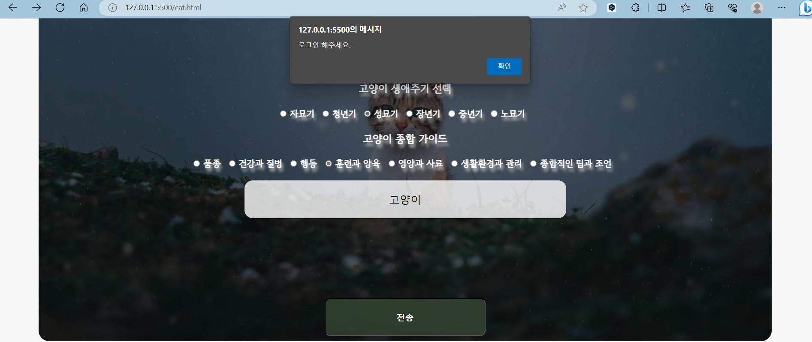
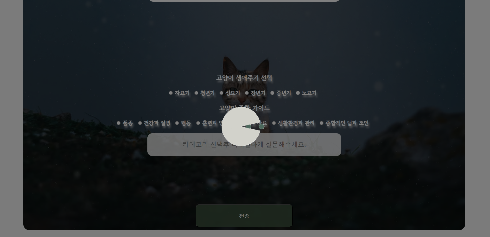
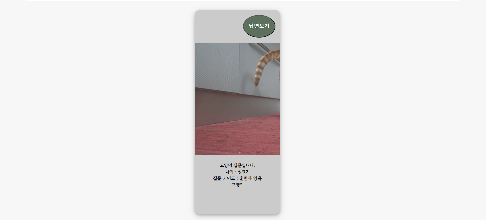
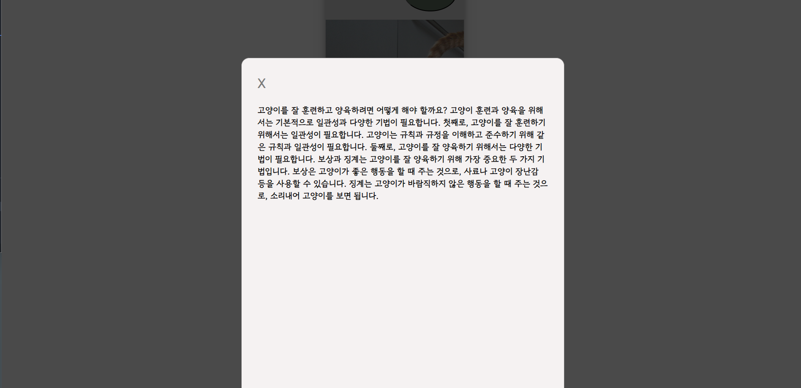
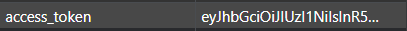

# Djangogpt
- Django Rest Framework를 사용해서 챗봇 API 통신하는 프로젝트입니다.
- 반려동물이 삶의 일부라 생각하는 사람들을 위해 궁금한점을 해결해주는 gptporject 

## 1. 목표와 기능

### 1.1 목표
- 목표 DRF를 통해 Frontend 프로젝트와 연결하는 것
### 1.2 기능
- 로그인, 로그아웃
- Token기반 회원 인증 
- FrontEnd에서 prompt를 통해 response DB 저장
- 챗봇이용횟수 제한


## 2. 개발 환경 및 배포 URL
- 개발환경
```
dj-rest-auth==4.0.1
Django==4.2.2
django-allauth==0.54.0
django-bootstrap5==23.3
djangorestframework==3.14.0
djangorestframework-simplejwt==5.2.2
```

## 3. 폴더 구조
```
📦gptapp
 ┣ 📂chatbot
 ┃ ┣ 📂migrations
 ┃ ┣ 📂templates
 ┃ ┣ 📜admin.py
 ┃ ┣ 📜apps.py
 ┃ ┣ 📜models.py
 ┃ ┣ 📜serializers.py
 ┃ ┣ 📜tests.py
 ┃ ┣ 📜urls.py
 ┃ ┣ 📜views.py
 ┃ ┗ 📜__init__.py
 ┣ 📂chat_project
 ┃ ┣ 📜.env
 ┃ ┣ 📜asgi.py
 ┃ ┣ 📜settings.py
 ┃ ┣ 📜urls.py
 ┃ ┣ 📜wsgi.py
 ┃ ┗ 📜__init__.py
 ┣ 📂user
 ┃ ┣ 📂migrations
 ┃ ┣ 📂__pycache__
 ┃ ┣ 📜admin.py
 ┃ ┣ 📜apps.py
 ┃ ┣ 📜models.py
 ┃ ┣ 📜serializers.py
 ┃ ┣ 📜tests.py
 ┃ ┣ 📜urls.py
 ┃ ┣ 📜views.py
 ┃ ┗ 📜__init__.py
 ┣ 📂venv
 ┃ ┣ 📂Include
 ┃ ┣ 📂Lib
 ┃ ┣ 📂Scripts
 ┣ 📜db.sqlite3
 ┣ 📜manage.py
 ┗ 📜requirements.txt
```
## 4. 에러가 자주 나온 code
chatlist를 만들기 위해서 해당 제목을 통해 chatbot의 response를 조회해서 리스트 출력하는 부분에서 frontend로그인 하고 나서 token으로 backend user를 못받아와서 에러가 많이 났다... 
postman에서는 잘 되었지만 안되니까 더 초조했기에 기획했던 프로젝트가 나오지 않았다. 일단 되는 부분까지만 commit하였습니다. 

```python
class Login(APIView):
    def post(self, request):

        if request.user.is_authenticated:
            print(request.user)
            return Response({'detail': '이미 인증된 사용자입니다.'}, status=status.HTTP_400_BAD_REQUEST)

        serializer = LoginSerializer(data=request.data)
        if serializer.is_valid():
            email = serializer.validated_data['email']
            password = serializer.validated_data['password']

            user = authenticate(request=request, email=email, password=password)

            print(f"인증된 유저? {user}")
            if user is not None:
                login(request, user)
                refresh = RefreshToken.for_user(user)
                access_token = str(refresh.access_token)
                token, _ = Token.objects.get_or_create(user=user)
                return Response({'message': '로그인에 성공하였습니다.', 'access_token': access_token,
                'email':email, 'token': token.key}, status=status.HTTP_200_OK)
            else:
                return Response({'message': '이메일 또는 비밀번호가 올바르지 않습니다.'}, status=status.HTTP_401_UNAUTHORIZED)

        return Response(serializer.errors, status=status.HTTP_400_BAD_REQUEST)
```

## 5. 페이지 UI







## 6. 느낀점
다시 한 번 느끼는 거지만 항상 내가 원하는 기획대로 되지 않는다.. 기획할 때만 해도 "이렇게 저렇게 하면 되겠구나" 라는 생각으로 기획하고 실행에 옮기지만 막히는 부분이 많았다.. 
Cors 에서도 많이 막혔고, token으로 로그인 하는것도 꽤 힘들었다. 전반적인 backend코드를 미리 짜놓은 다음 frontend에서 맞추는 과정에서 시간이 많이 소요 되었던거 같다.
이번 과제를 통해서 backend와 frontend에 대해서 조금은 더 알게 되었던거 같다.